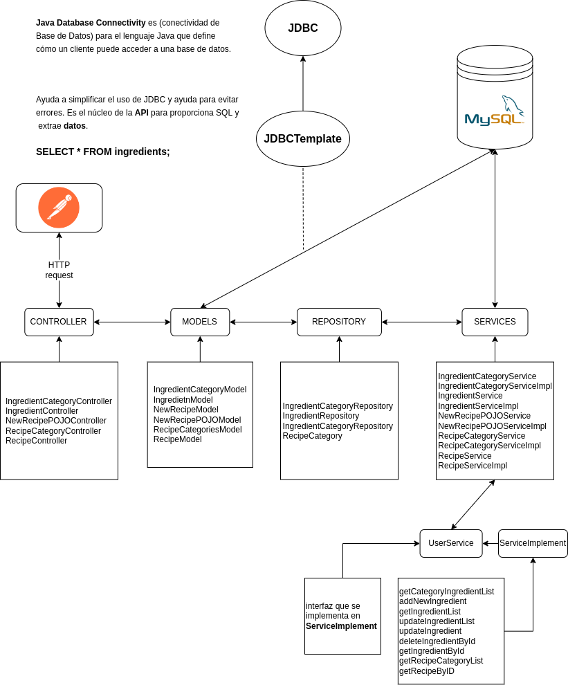

# ProjectFullstack

## Overview
ProjectFullstack is a full-stack web application that integrates frontend, backend, and database technologies to deliver a complete web solution.

## Technologies Used
### Frontend:
- **HTML** – Structure of the web pages.
- **CSS** – Styling and layout design.
- **Bootstrap 5** – Responsive design and UI components.
- **JavaScript** – Dynamic behavior and interactivity.

### Backend:
- **Java** – Core programming language.
- **Spring Boot** – Backend framework for handling requests and business logic.

### Database:
- **MySQL** – Relational database used to store and manage application data.
- **Spring Boot JPA** – Handles database interactions and ORM mapping.

## Setup and Installation
1. Clone this repository:
   ```bash
   git clone https://github.com/Daruuu/ProjectFullstack.git
   ```
2. Navigate to the project directory.
3. **Backend Setup:**
   - Install Java and Spring Boot.
   - Configure MySQL database connection in `application.properties`.
   - Run the Spring Boot application.

4. **Frontend Setup:**
   - Open the frontend files in a browser or serve them using a local development server.

## Features
- User authentication and authorization.
- CRUD operations integrated with MySQL.
- Responsive design using Bootstrap 5.
- RESTful API endpoints for seamless frontend-backend communication.


